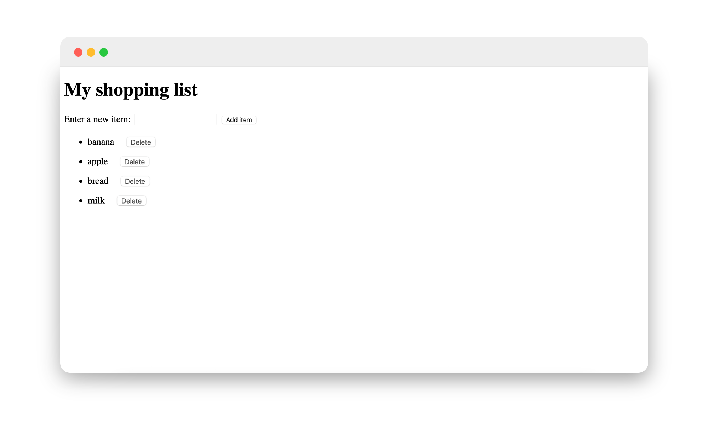

# Personal Project: ToDo List

This project has equipped me with a robust skill set in JavaScript development, focusing on key aspects essential for creating sophisticated web applications. I've mastered DOM manipulation using vanilla JavaScript to dynamically create, modify, and remove elements based on user interactions, ensuring a responsive and interactive user interface. Advanced event handling techniques have been seamlessly integrated to enhance the user experience with smooth interactions.

Efficient code organization was a priority, ensuring clear and maintainable structures. I optimized usability across devices with a responsive UI and dynamic JavaScript updates. Cross-browser compatibility was achieved through thorough validation and polyfill implementation, enhancing performance across platforms. Real-time data handling securely enabled dynamic UI updates based on user input, enhancing engagement. Optimization techniques minimized overhead, significantly improving application performance, while effective version control practices ensured collaborative development and maintained code integrity through iterative improvements.

  

Note: no CSS was applied to this project to save time and build something else!

 
 

<h3>JavaScript Concepts Applied
</h3>

- DOM manipulation
- Event handling
- function declaration and execution and anonymous functions
- addEventListener("click", )
- querySelector()
- getElementById()
- addEventListener()
- createElement()
- appendChild()
- .remove()